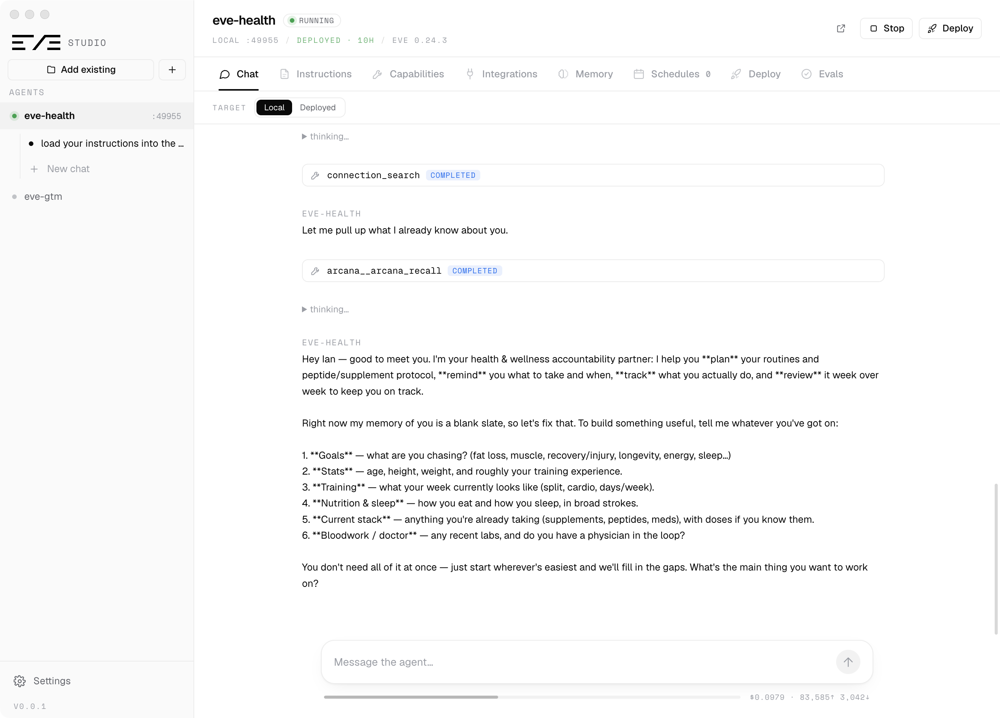

# Eve Studio

**A desktop control center for [Eve](https://vercel.com/eve) agents.** Run, chat with, build, wire up, and deploy every Eve agent on your machine — from one native app, without living in a terminal.

Eve Studio is an Electron app that discovers the Eve agents on your disk and gives each one a full workspace: a chat console (local **and** deployed), a prompt/model editor, first-class editing for every capability (tools, skills, subagents, hooks, schedules), integrations (connections & channels), long-term memory, one-click Vercel deploys, and evals.



> Status: early / personal project (`v0.0.1`), macOS-first. Built on the Eve **beta**.

---

## What it does

Point it at a folder that contains an Eve agent (or create a new one in-app) and you get, per agent:

- **Chat** — a clean conversation console that streams the agent's turns, tool calls, subagent delegations, reasoning, and approval prompts. Talk to the **local dev server** or your **deployed production** agent from the same window. Threads live inline in the sidebar and can be **archived** so the list stays tidy.
- **Instructions & Model** — edit the system prompt (`instructions.md`) and the model/reasoning (`agent.ts`) directly.
- **Capabilities** — browse **tools, skills, subagents, and hooks**, scaffold new ones, and **open · edit · delete** their source files in an in-app editor (SKILL.md for skills; `agent.ts` + `instructions.md` for subagents).
- **Integrations** — manage **connections** (MCP / OpenAPI) and **channels**, and wire Vercel **Connect** connectors.
- **Memory** — see whether the agent is using Eve's native durable sessions or an external long-term brain ([Arcana](https://kybernesis.ai)), and wire it up.
- **Schedules** — view and create cron-driven jobs.
- **Deploy** — link the agent to Vercel and ship to production in-app (no terminal), with logs, environment/secrets management, and a sandbox view.
- **Evals** — run the agent's eval suite and read results.

The guiding principle: **a non-technical operator should never have to open a terminal.** Linking to Vercel, pulling env, pushing secrets, deploying, and editing capabilities all happen through the UI.

---

## How it works

Eve is **filesystem-first**: an agent's capabilities are discovered from its directory layout (`agent/tools/*.ts`, `agent/skills/<name>/SKILL.md`, `agent/hooks/*.ts`, `agent/subagents/<id>/`, …). Eve Studio leans on that:

```
┌─────────────────────────────────────────────────────────────┐
│  Renderer (React + TS + Tailwind + Zustand)                  │
│  agent rail · per-agent workspace tabs · chat · editors      │
└───────────────▲───────────────────────────┬─────────────────┘
                │  window.studio (preload)   │  IPC (contextIsolated)
┌───────────────┴───────────────────────────▼─────────────────┐
│  Main process (Electron / Node)                              │
│  • spawns `eve dev` per agent, adopts existing servers       │
│  • reads the compiled manifest for structure                 │
│  • authors / edits / deletes capability files on disk        │
│  • drives the Vercel CLI (link, env, connect, deploy)        │
└───────────────▲───────────────────────────┬─────────────────┘
                │  HTTP  /eve/v1/session…    │  child processes
        ┌───────┴────────┐          ┌────────▼─────────┐
        │  Eve dev server │          │  Vercel CLI / gh │
        │  (local agent)  │          │  Blob · Gateway  │
        └─────────────────┘          └──────────────────┘
```

- **Chat** talks to the Eve session HTTP API (`POST /eve/v1/session`, `GET …/stream`) — the same contract locally and against a deployed URL (with a Deployment Protection bypass header for protected deployments).
- **Structure** (the tabs' contents) is read from Eve's compiled agent manifest, so what you see is exactly what Eve discovered.
- **Authoring** writes real files with the same scaffolds Eve expects, and edits/deletes are path-safe (nothing outside the agent directory is ever touched).
- **Deploy** shells out to the Vercel CLI for linking, env pull/push, connector management, and production deploys.

### Project layout

```
src/
  main/       Electron main — agent process mgmt, IPC, structure, authoring, Vercel
  preload/    context-isolated bridge exposed as window.studio
  renderer/   React app — agent rail, per-agent tabs, chat, editors, ui kit
  shared/     IPC channel names + shared types
```

---

## Getting started

**Prerequisites:** Node ≥ 20 (24 recommended), [pnpm](https://pnpm.io), and at least one Eve agent on disk. For deploys, the [Vercel CLI](https://vercel.com/docs/cli) and [`gh`](https://cli.github.com) signed in.

```bash
pnpm install     # install dependencies
pnpm dev         # launch the app (electron-vite dev)
pnpm typecheck   # tsc, no emit (node + web projects)
pnpm build       # electron-vite build
pnpm package     # build a distributable via electron-builder
```

On first run, **Add existing** to point at an agent folder, or **Create new** to scaffold one (`eve init`) from inside the app.

---

## Tech stack

- **[Electron](https://www.electronjs.org)** + **[electron-vite](https://electron-vite.org)** — CJS main/preload, ESM renderer, context-isolated preload bridge (`window.studio`).
- **React 18 + TypeScript (strict)** — renderer UI.
- **[Tailwind CSS](https://tailwindcss.com)** + **[Zustand](https://zustand-demo.pmnd.rs)** — styling and state.
- **[Geist](https://vercel.com/font)** + **Space Mono** (self-hosted via `@fontsource`) — typography.
- Packaged with **[electron-builder](https://www.electron.build)**.

---

## About Eve & Vercel

Eve is Vercel's agent framework — filesystem-first, deploys as Vercel Functions, and integrates with the Vercel platform.

- **Eve on Vercel** — <https://vercel.com/eve>
- **Eve (beta)** — <https://beta.eve.dev>
- **Vercel docs** — <https://vercel.com/docs>
- **Vercel AI Gateway** (model access) — <https://vercel.com/docs/ai-gateway>
- **Vercel Blob** (agent file/image storage) — <https://vercel.com/docs/vercel-blob>
- **Vercel CLI** — <https://vercel.com/docs/cli>
- **Deployment Protection** (bypass for automation) — <https://vercel.com/docs/deployment-protection>

Eve ships its own docs inside each agent's `node_modules/eve/docs/` (tools, skills, subagents, hooks, channels, connections, schedules, sandbox, evals) — the authoritative reference for authoring.

---

## Notes

- macOS-first today. `.env*`, `node_modules`, and build output are gitignored; the app never stores or commits secrets (Vercel Connect connectors and OIDC tokens are used instead of keys where possible).
- Not affiliated with Vercel. "Eve" and "Vercel" are Vercel's; this is an independent tool for working with Eve agents.
